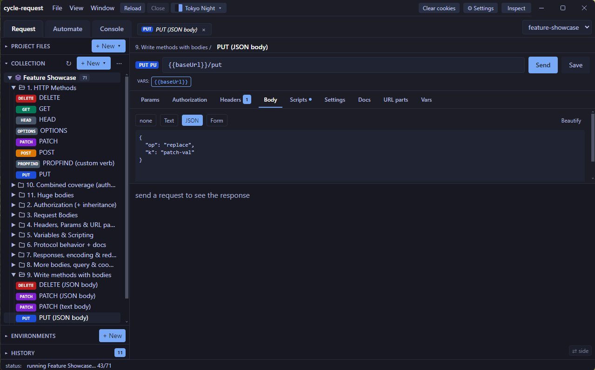
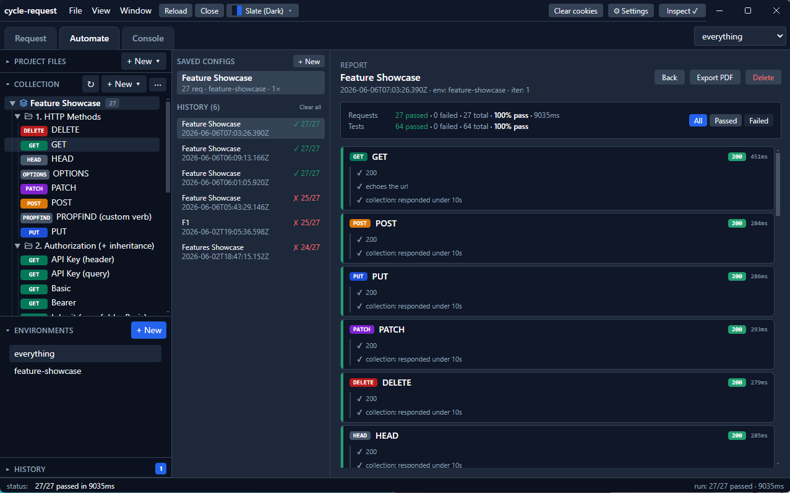
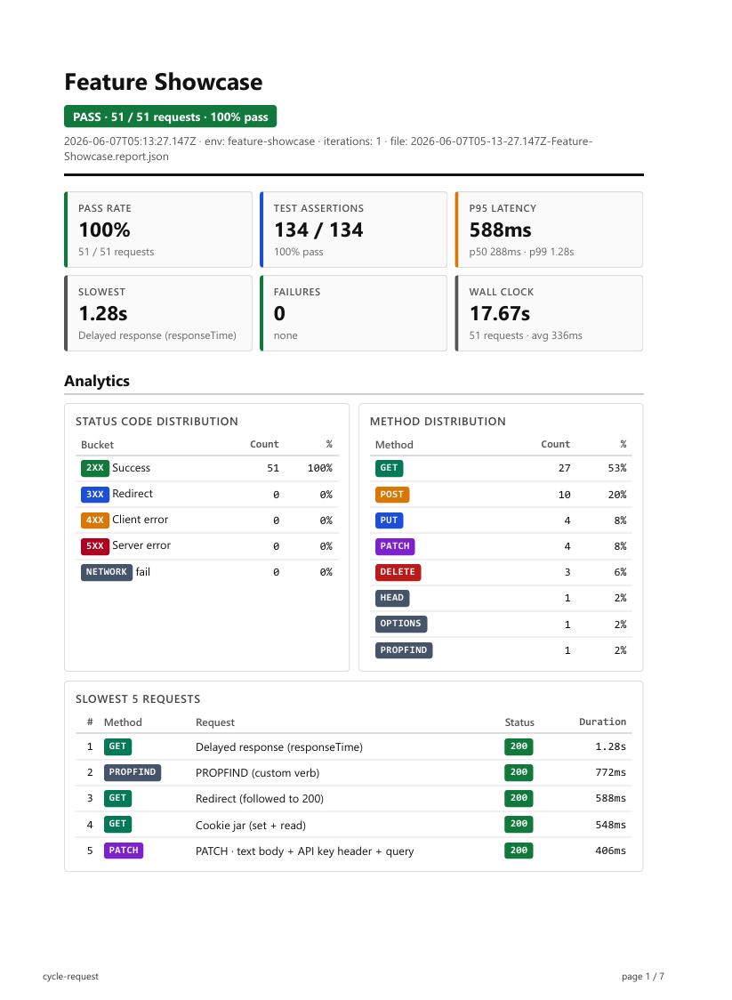
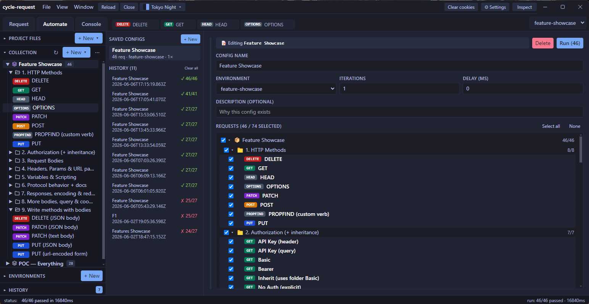
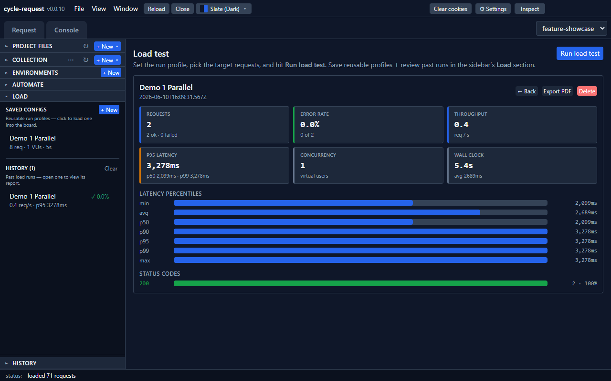

# cycle-request — downloads

**A cross-platform desktop IDE for HTTP / API testing — a git-friendly Postman alternative.**

This repository is the public **download home** for the packaged installers and
portable builds of [**cycle-request**](https://github.com/MrParkerZ7/project-cycle-request).
It holds no source code — every release here is built and published automatically
from the source repo when a version tag is pushed.

> ⬇️ **[Download the latest release →](../../releases/latest)**

---

## What is cycle-request?

cycle-request is a desktop app for building, sending, and automating HTTP requests —
the same job Postman or Insomnia do — with one defining difference: **your
collections are plain JSON files on disk**, one file per request, so they live in
your git repo and diff / branch / PR like any other code. No cloud account, no sync
service, no lock-in. Share a collection by committing it.

It speaks **Postman's file format natively** (`.postman_collection.json`), so you can
open existing Postman collections directly and hand them back unchanged.

## Screenshots

**Request editor** — build a request with methods, bodies, headers, auth, variables, pre/test scripts, and per-request docs. Collections and folders live in the left tree.

**Automate (collection runner)** — run a whole collection, watch per-request results and `pm.test` assertions, with saved run configs and persisted history.

**Export-to-PDF report** — a polished run report: pass rate, latency percentiles, status-code & method distribution, and the slowest requests.

**Build a reusable run** — pick requests across the collection and save the configuration to re-run any time.

**Load testing** — drive a k6-style concurrent load test from your existing collection, then review a full results dashboard for every run: requests, error rate, throughput, latency percentiles (p50–p99), concurrency, wall-clock, and status-code distribution — saved to history and exportable to PDF.

## Key features

- **Collections, folders & requests** — the familiar Postman hierarchy, stored as
  human-readable JSON so version-control diffs are surgical.
- **All HTTP methods** — GET / POST / PUT / PATCH / DELETE / HEAD / OPTIONS plus
  arbitrary custom verbs (PURGE, MKCOL, …).
- **Environments & variables** — layered scopes (collection → environment → request),
  `{{var}}` substitution in URL / headers / body / scripts, committed env files for
  shared non-secret values, and a gitignored local store for secrets and
  script-captured "current values".
- **Pre-request & test scripts** — a Postman-compatible `pm.*` scripting API
  (`pm.environment`, `pm.variables`, `pm.test`, `pm.expect` with the full chai chain,
  `pm.response.*`) running in a sandboxed JS runtime.
- **Authorization** — Basic, Bearer, API-key, and OAuth 2 — plus **inherit from
  parent**: set auth once on a collection or folder and child requests inherit it.
- **Automate (collection runner)** — saved run configs, persisted run history, a live
  progress view, and an **Export-to-PDF** report (KPI grid + analytics tables +
  per-request detail).
- **Import & export** — import from **Postman v2.1 · Insomnia v4 · HAR · cURL**;
  export back to Postman v2.1 or copy any request as a cURL one-liner.
- **Recent folders** — an IDE-style "Open Recent" list on the welcome screen
  (pin · remove · clear), so reopening a workspace is one click. *(new in v0.0.5)*
- **Console, history & cookie jar** — captured `console.*` output per run, a
  re-sendable request history, and a shared cookie jar.
- **17 themes + adjustable density** — dark and light themes (Tokyo Night, Dracula,
  Cyberpunk, Synthwave, Rosé Pine, Everforest, …) and Standard / Compact /
  Ultra-compact spacing; both persist across restarts.

A fuller capability breakdown — on-disk format, variable precedence, the scripting
API surface, data locations, and the platform matrix — lives in **[SPEC.md](SPEC.md)**.

---

## Download & install

Grab the asset for your platform from the **[latest release](../../releases/latest)**.
Each release ships an **installer** and a **portable** build per platform:

| Platform | Installer | Portable |
|----------|-----------|----------|
| **Windows** (x64) | `cycle-request.Setup.<version>.exe` (NSIS) | `cycle-request-<version>-win.zip` |
| **macOS** (Apple Silicon / arm64) | `cycle-request-<version>-arm64.dmg` | `cycle-request-<version>-arm64-mac.zip` |
| **Linux** (x64) | `cycle-request-<version>.AppImage` | `desktop-electron-<version>.zip` |

Plus `latest*.yml` files — auto-update metadata for a future updater; not needed for
manual installs.

### Per-platform steps

- **Windows** — run the `.exe` installer and pick an install directory, **or** unzip
  the portable `.zip` and run `cycle-request.exe`.
- **macOS** — open the `.dmg` and drag the app to Applications, **or** unzip the
  `.zip` and move the app to Applications.
- **Linux** — `chmod +x cycle-request-<version>.AppImage` and run it, **or** unzip
  the portable `.zip` and run the `cycle-request` binary inside.

### ⚠️ A note on code signing

These builds are **not yet code-signed or notarized**, so your OS will warn that the
app is from an unidentified developer:

- **macOS** — right-click the app → **Open** (instead of double-click) the first
  time, then confirm. Or run:
  `xattr -dr com.apple.quarantine /Applications/cycle-request.app`
- **Windows** — SmartScreen may show a blue prompt → **More info → Run anyway**.

Signing + notarization + an in-app auto-updater are on the roadmap.

### Platform notes

- **macOS** builds are **Apple Silicon (arm64) only** right now — there is no Intel
  (x64) macOS build yet.
- **Linux** is built against glibc (x64). The portable archive is currently named
  `desktop-electron-<version>.zip`.
- No system webview or runtime is required — the app bundles its own Chromium
  (Electron).

---

## Releases & versioning

cycle-request follows [Semantic Versioning](https://semver.org/). The per-release
changelog lives with the source:
**[CHANGELOG.md](https://github.com/MrParkerZ7/project-cycle-request/blob/main/CHANGELOG.md)**.
Each GitHub Release on this repo also carries its own notes and the full asset set.

## How a release is cut (maintainers)

The source lives in **[`project-cycle-request`](https://github.com/MrParkerZ7/project-cycle-request)**.
Pushing a `vX.Y.Z` tag there runs its `Release` GitHub Actions workflow, which builds
the Electron app on win / macOS / Linux runners and publishes a GitHub Release **here**
with the installers + portable archives above.

**One-time setup:** the source repo needs a `RELEASE_PAT` secret — a token with
**Contents: read & write** on this repo — so its workflow can publish here (a repo's
`GITHUB_TOKEN` is scoped to its own repo only).

## Legal & Security

cycle-request is **MIT-licensed** — see [`LICENSE`](LICENSE) (same license as the source
project). Full legal + policy documents live in the source repo:

- [LICENSE](https://github.com/MrParkerZ7/project-cycle-request/blob/main/LICENSE) — MIT
- [Third-party licenses & attributions](https://github.com/MrParkerZ7/project-cycle-request/blob/main/THIRD-PARTY-LICENSES.md) — bundled dependencies
- [Security policy](https://github.com/MrParkerZ7/project-cycle-request/blob/main/SECURITY.md) — how to report a vulnerability
- [EULA](https://github.com/MrParkerZ7/project-cycle-request/blob/main/EULA.md) · [Disclaimer & acceptable use](https://github.com/MrParkerZ7/project-cycle-request/blob/main/DISCLAIMER.md)

> Installers are currently **unsigned** — Windows SmartScreen / macOS Gatekeeper may
> warn on first launch; allow it through to proceed.
